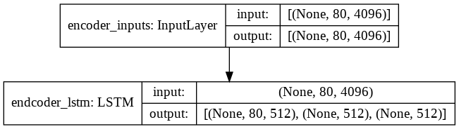
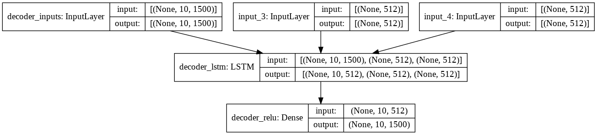
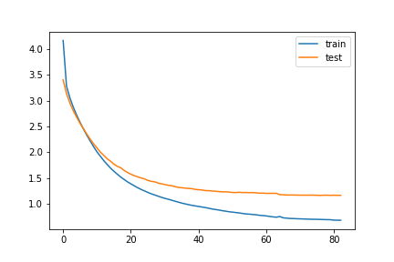
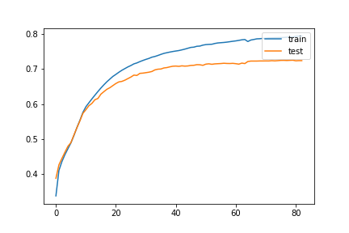

# Video-Captioning

Video Captioning is an encoder decoder mode based on sequence to sequence learning.
It takes a video as input and generates a caption describing the event in the video. 

The importance of captioning lies in its ability to make video more accessible in numerous ways. 
Automated video caption generator helps searching of videos in websites better. 
It can be used for clustering of videos based on their content easier.

## Table of contents
* [Inspiration](#Inspiration)
* [Sample Results](#Sample-Results) 
* [Dataset](#Dataset)
* [Setup](#Setup)
* [Usage](#Usage)
* [Model](#Model)
  * [Training Architecture](#Training-Architecture)
  * [Inference Architecture](#Inference-Architecture)
  * [Loss](#Loss)
  * [Metric](#Metric)
* [Features](#Features)
* [Scripts](#Scripts)
* [Future development](#Future-Development)
* [References](#References)

## Inspiration
I was looking around for some new projects when I came across video captioning and I realised the lack of good resources. 
I hope this project makes it easier for people to implement video captioning.

## Sample Results
Here is a clip of realtime prediction on the testing data.

## Dataset
This project is build on the [MSVD](https://drive.google.com/file/d/0B18IKlS3niGFNlBoaHJTY3NXUkE/view) dataset. 
It contains 1450 training videos and 100 testing videos.

## Setup
Clone the repository :`git clone https://github.com/Shreyz-max/Video-Captioning.git`

Video Caption Generator: `cd Video-Captioning`

Create environment: `conda create -n video_caption python=3.7`

Activate environment: `conda activate video_caption`

Install requirements: `pip install -r requirements.txt`

## Usage
To use the models that have already been trained

Add a video to **data/testing_data/video** folder and run the predict realtime file as `python predict_realtime.py`

For faster results extract the features of the video and save it in feat folder of the testing_data.

To convert into features run the extract_features.py file as `python extract_features.py`

Run train.py for local training or use the Video_Captioning.ipynb notebook 

## Model

### Training Architecture

### Inference Architecture

#### Encoder Model

#### Decoder Model

#### Loss
This is the graph of epochs vs loss. The loss used is categorical crossentropy.

#### Metric
This is the graph of epochs vs metric. The metric used is accuracy.

## Features
 * Realtime implementation
 * Two types of search algorithms depending upon the requirements
 * Beam search and Greedy search
 
Greedy search selects the most likely word at each step in the output sequence.
Beam search algorithm selects multiple alternatives for an input sequence at each timestep based on conditional probability.
To get more information on these search algorithms check out this [post](https://machinelearningmastery.com/beam-search-decoder-natural-language-processing/) 

### Performance of both algorithms on testing data
|Video|Beam Text(Time taken)|Greedy Text(Time taken)|
|:-:|:-:|:-:|
||a woman is seasoning some food(22.05s)|a woman is seasoning some food(0.70s)|
||a man is singing (13.79s) |a man is performing on a stage(0.77s)|
||the animal is sitting on the ground (21.16)|a person is playing(0.67s)|
||a man is riding a bicycle (22.20) |a man is riding a bicycle(0.66)|
||a man is spreading a tortilla (25.65) |a man is spreading a tortilla (0.75)
||a woman is mixing some food (35.91) |a woman is mixing some food(0.72)|
||a dog is dancing (15.58) |a dog is making a dance(0.68)
||a person is cutting a pineapple (24.31) |a person is cutting a piece of pieces(0.70)|
||a cat is playing the piano (26.48) |a cat is playing the piano(0.70)|
||a man is mixing ingredients in a bowl (38.16) |a man is mixing ingredients in a bowl(0.69)|

 ## Scripts
 * **train.py** contains the model architecture
 * **predict_test.py** is to check for predicted results and store them in a txt file along with the time taken for each prediction
 * **predict_realtime.py** checks the results in realtime
 * **model_final** folder contains the trained encoder model along with the tokenizerl and decoder model weights.
 * **features.py** extracts 80 frames evenly spread from the video and then those video frames are processed by a pre-trained VGG16 so each frame
    has 4096 dimensions. So for a video we create a numoy array of shape(80, 4096)
    config.py contains all the configurations i am using
 * **Video_Captioning.ipynb** is the notebook i used for training and building this project.

## Future Development
 * Adding attention blocks and pretrained embeddding like glove so that the model understands sentences better
 * Using other pretrained models to extract features specially ones made for understanding videos like I3D
 * Right now the model uses only 80 frames improvements need to be made so that it can work even for longer videos
 * Adding a UI to the project
 
 ## References
 
 [SV2T paper 2015](https://arxiv.org/abs/1505.00487)
 
 [Keras implementation](https://github.com/CryoliteZ/Video2Text)
 
[Intelligent-Projects-Using-Python](https://github.com/PacktPublishing/Intelligent-Projects-Using-Python/blob/master/Chapter05) 

